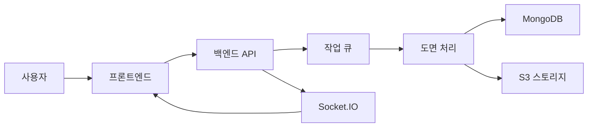

# DWG Plan Processor

DWG 도면 파일을 처리하고 시각화하는 웹 애플리케이션입니다.

## 프로젝트 구조

```
dwg-plan/
├── frontend/           # React 프론트엔드
│   ├── src/
│   │   ├── assets/      # 이미지 등 정적 자원
│   │   ├── components/  # 재사용 가능한 UI 컴포넌트
│   │   ├── context/     # React Context (Socket.IO 등)
│   │   ├── hooks/       # 커스텀 훅
│   │   ├── pages/       # 페이지 컴포넌트
│   │   ├── services/    # API 통신 서비스
│   │   ├── styles/      # CSS 스타일
│   │   └── utils/       # 유틸리티 함수
│   └── public/
└── backend/            # Node.js 백엔드
    ├── config/         # 설정 파일
    ├── controllers/    # 요청 처리 컨트롤러
    ├── middleware/     # 미들웨어
    ├── models/         # MongoDB 모델
    ├── routes/         # API 라우트
    ├── services/       # 비즈니스 로직
    ├── utils/          # 유틸리티 함수
    ├── uploads/        # 업로드된 파일 저장
    ├── temp/           # 임시 파일
    └── results/        # 처리 결과 파일
```

## 데이터 흐름



1. 사용자가 DWG 파일을 업로드
2. 백엔드에서 작업 ID 생성 및 작업 큐에 추가
3. 실시간 처리 상태를 Socket.IO로 프론트엔드에 전송
4. 처리된 결과를 S3에 저장하고 MongoDB에 메타데이터 저장
5. 처리 완료 시 프론트엔드에서 결과 표시

## 주요 기능

- DWG 파일 업로드 및 처리
- 실시간 처리 상태 모니터링
- 처리된 도면 시각화
- 레이어 관리 및 필터링
- 도면 메타데이터 분석

## 기술 스택

- **프론트엔드**
  - React
  - Socket.IO-client
  - React Context API
  - Custom Hooks

- **백엔드**
  - Node.js
  - Express
  - Socket.IO
  - MongoDB
  - AWS S3

## 실시간 처리 로직

1. **작업 생성**
   ```javascript
   // 프론트엔드
   const jobId = await createJob(file);
   useProgress(jobId, handleComplete);
   ```

2. **상태 모니터링**
   - Socket.IO를 통한 실시간 업데이트
   - 폴링을 통한 백업 상태 확인
   ```javascript
   socket.on('progress', handleProgress);
   setInterval(checkStatus, 3000);
   ```

## 설치 및 실행

### 요구사항

- Node.js 14.x 이상(v18.20.2)
- MongoDB 8.0.9
- [ODA File Converter](https://www.opendesign.com/guestfiles/oda_file_converter) (v26.4.0)
- AWS S3 버킷 (또는 대체 스토리지)

### 1. MongoDB 설정

1. [MongoDB Community Server](https://www.mongodb.com/try/download/community) 설치
2. MongoDB 서비스 실행
   ```bash
   # Windows의 경우 서비스에서 MongoDB 실행 확인
   # Linux/Mac의 경우
   sudo service mongod start
   ```

### 2. ODA File Converter 설정

1. [ODA File Converter](https://www.opendesign.com/guestfiles/oda_file_converter) 다운로드 및 설치
2. 설치 경로 확인 (환경 변수 설정에 필요)
   - Windows 일반 설치 경로: `C:\Program Files\ODA\ODAFileConverter\ODAFileConverter.exe`
   - Mac/Linux: `/usr/local/bin/ODAFileConverter`

### 3. 환경 변수 설정

1. Backend (.env)
   ```
   # 서버 설정
   PORT=5000
   NODE_ENV=development

   # MongoDB
   MONGODB_URI=mongodb://localhost:27017/dwg-plan

   # AWS S3
   AWS_ACCESS_KEY_ID=your_access_key
   AWS_SECRET_ACCESS_KEY=your_secret_key
   AWS_REGION=ap-northeast-2
   AWS_S3_BUCKET=your-bucket-name

   # ODA File Converter(예)
   ODA_CONVERTER_PATH="C:\\Program Files\\ODA\\ODAFileConverter\\ODAFileConverter.exe"
   
   # 파일 처리 설정
   MAX_FILE_SIZE=50000000  # 50MB
   TEMP_DIR=./temp
   ```

2. Frontend (.env)
   ```
   REACT_APP_API_URL=http://localhost:5000
   REACT_APP_MAX_FILE_SIZE=10485760
   ```

### 4. 의존성 설치

```bash
# Backend
cd backend
npm install

# Frontend
cd frontend
npm install
```

### 5. 실행

1. MongoDB 실행 확인
2. 백엔드 서버 실행
   ```bash
   cd backend
   npm run dev
   ```
3. 프론트엔드 실행
   ```bash
   cd frontend
   npm start
   ```
4. 브라우저에서 접속: http://localhost:3000

### 6. 문제 해결

#### MongoDB 연결 오류
- MongoDB 서비스가 실행 중인지 확인
- MongoDB 포트(27017) 사용 가능 여부 확인
- MongoDB 접속 URI 확인

#### ODA File Converter 오류
- ODA File Converter 설치 확인
- 환경 변수의 경로가 올바른지 확인
- Windows의 경우 경로에 이스케이프 문자(`\\`) 사용 확인

## API 엔드포인트

- `POST /api/jobs` - 새 작업 생성
- `GET /api/jobs/:id` - 작업 상태 조회
- `GET /api/jobs/:id/result` - 처리 결과 조회

## Socket.IO 이벤트

- `join` - 작업 룸 참가
- `progress` - 처리 진행률 업데이트
- `error` - 오류 발생 알림
- `complete` - 작업 완료 알림

## 처리 로직

### 1. 파일 업로드 및 작업 생성
- 사용자가 DWG 파일 업로드
- 파일 유효성 검사 (크기, 형식)
- 작업 ID 생성 및 초기 상태 저장
- 임시 저장소에 파일 저장

### 2. DWG → DXF 변환
- ODA File Converter를 사용하여 DWG 파일을 DXF 형식으로 변환
- 변환된 DXF 파일 저장 및 관리
- 변환 상태 모니터링

### 3. DXF 파일 분석 및 처리
- DXF 파일 파싱 및 구조 분석
- 도면 요소 추출 및 정규화
  - 레이어 정보
  - 엔티티(선, 호, 텍스트 등) 데이터
- 문(Door) 감지
  - ARC 타입 문: 반경 및 각도 기반 감지
  - INSERT 블록 문: 블록 이름 기반 감지
- 텍스트 요소 추출 및 분석

### 4. SVG 변환 및 강조
- DXF 데이터를 SVG 형식으로 변환
- 감지된 문 위치에 빨간색 박스 표시
  - 문 중심점 계산
  - 크기에 맞는 마커 생성
- 관련 텍스트 레이블 추가
- SVG 최적화 및 스타일링

### 5. 실시간 상태 관리
- Socket.IO를 통한 진행률 전송
- 폴링을 통한 백업 상태 확인
- 처리 단계별 상태 업데이트
- 오류 발생 시 즉시 알림

### 6. 결과 처리
- 최종 SVG 저장
- 분석 결과 메타데이터 저장
  - 감지된 문 정보
  - 텍스트 요소
  - 레이어 구조
- 임시 파일 정리
- 클라이언트에 완료 통보

### 7. 후처리
- 작업 이력 관리
- 리소스 정리 